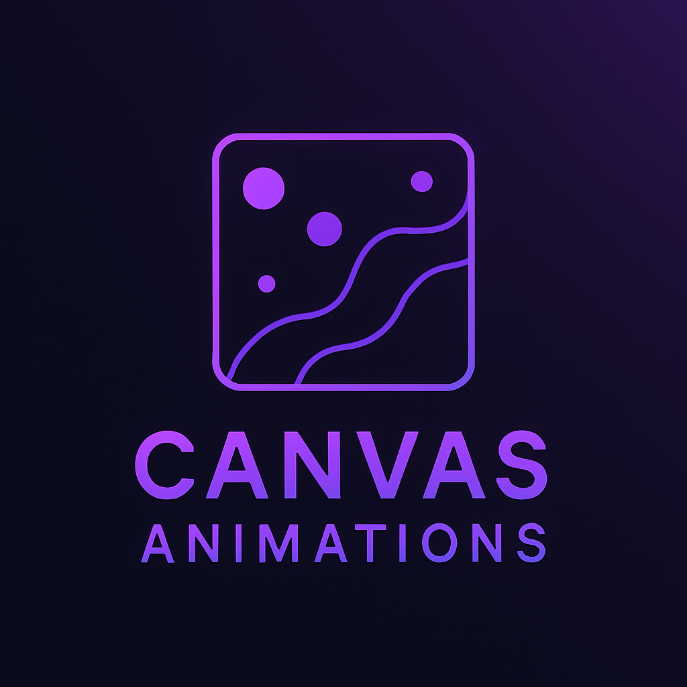

# 🎨 Canvas Animated Backgrounds  

<p align="center">
  
</p>  

A collection of **minimal and aesthetic animations** created using **HTML5 Canvas & JavaScript**—no external libraries needed! 🚀  

## 🎨 Why Use Canvas-Based Animations?  

### 🚀 **Advantages of Canvas Animations**  
Using **HTML5 Canvas** for animations offers several benefits over traditional CSS or library-based animations:  

✅ **High Performance** – Canvas utilizes the GPU efficiently, enabling smooth and optimized animations even for complex effects.  
✅ **Full Control Over Graphics** – Unlike CSS animations, canvas lets you manipulate pixels directly, allowing for **dynamic and interactive** visuals.  
✅ **Lightweight & Dependency-Free** – No need for external libraries like GSAP or Framer Motion—reducing bundle size and improving load times.  
✅ **Customizable & Versatile** – Fine-tune animations with parameters such as speed, colors, particle behavior, and interaction handling.  
✅ **Ideal for Background Effects** – Perfect for **hero sections, dashboards, landing pages, and interactive UI elements** without heavy DOM updates.  

### 🔥 **Where Can You Use Canvas Animations?**  
Canvas-based animations are widely used in:  
- **Website Backgrounds & Hero Sections** (Subtle moving particles, abstract waves, or dynamic visuals)  
- **Interactive Dashboards** (Real-time visualizations, data-driven animations)  
- **Gaming & Simulations** (Physics-based movements, fluid dynamics)  
- **Creative Coding & Art** (Generative art, dynamic effects, procedural patterns)  
- **Loading Screens & Transitions** (Animated loaders, splash screens, seamless transitions)  

💡 **When to Use CSS or JavaScript Libraries Instead?**  
If you need **basic UI animations** like button hovers, fade-ins, or slide effects, CSS or Framer Motion might be more efficient.  
However, for **complex, interactive, and performance-optimized graphics**, Canvas is the best choice!  


## 🌟 Features  

✅ **Pure JavaScript & HTML5 Canvas** (No external dependencies)  
✅ **Optimized for Performance** (Smooth animations, minimal CPU/GPU load)  
✅ **Lightweight & Easy to Customize**  
✅ **Ideal for Websites, Dashboards, and Interactive UI Backgrounds**  
✅ **Ready-to-use for React users!**  

## 🖌️ Available Animations  

| Animation Name               | Description |
|------------------------------|-------------|
| **✨ Particle Background**    | Floating particles with link effects (like Particles.js) |
| **🚀 Warp Speed Starfield**   | A hyper-speed star tunnel effect (Space Warp) |
| **🟢 Floating Orbs**          | Orbs Floating around randomly |
| **🌧️ Pixel Rain**             | Pixels falling like digital rain |
| **🔥 Firefly Effect**         | Random glowing particles moving naturally like fireflies |
| **🌊 Waves / Sine Animation** | Soft-moving wave lines for a smooth aesthetic |
| **💥 Explosion Effect**       | Particles expanding outward in an explosion-like effect |\
| **🎆 Fireworks Display**      | Random colorful fireworks bursting at different points
| **🌪️ Swirling Vortex**        | A spinning vortex of particles moving towards the center
| **🔵 Bubble Float**           | Bubbles of different sizes floating upwards and popping
| **⚡ Lightning Strikes**      | Random streaks of lightning flashing across the screen
| **☁️ Fog / Smoke Effect**     | A smooth, rolling fog effect for a mysterious feel
| **🌠 Shooting Stars**         | Stars moving in random directions like a meteor shower
| **🌊 Water Ripple Effect**    | Realistic ripples spreading out when clicked
| **🌫️ Misty Glow Particles**   | Slow-moving mist particles with a glowing aura


## 🛠️ Usage  

### **🔹 For Plain HTML Users**
1. **Clone the Repository**  
   ```sh
   git clone https://github.com/YOUR_GITHUB_USERNAME/canvas-animations.git
   ```
2. **Open `index.html` in a browser**  
   Simply open any animation file to see it in action!  

3. **Embed in Your Project**  
   Copy the corresponding `JS` file and include it in your HTML file:  
   ```html
   <canvas id="animationCanvas"></canvas>
   <script src="particleBackground.js"></script>
   ```
   Make sure to set up a `canvas` element in your HTML.  

### **🔹 For React Users**
You can **directly copy-paste** the animation file into your React project and use it as a **component**.  

1. **Copy any animation file (e.g., `ParticleBackground.jsx`)**  
2. **Import it into your React component:**  
   ```jsx
   import ParticleBackground from './ParticleBackground';

   function App() {
      return (
         <div className="app-container">
            <ParticleBackground />
         </div>
      );
   }

   export default App;
   ```
3. **Done!** The animation will run as a background in your React app.  

## 📌 Customization  

Each animation has configurable parameters like:
- `particleCount`
- `speed`
- `color`
- `opacity`
- `wave frequency`
- `click effects`

React users can pass **props** to customize animations, for example:  
```jsx
<ParticleBackground particleCount={150} particleColor="#ff00ff" speed={0.8} />
```

## 🎯 Demo  

🚀 Live preview (Coming soon!)  

## 🤝 Contributing  

Want to add your own animations? Feel free to open a pull request!  

## 📜 License  

MIT License 

---
👨‍💻 Created by **[Nakul Srivastava]**  
🔗 Portfolio: [Please Check Out!](https://nakul-srivastava-dev.vercel.app/)  


